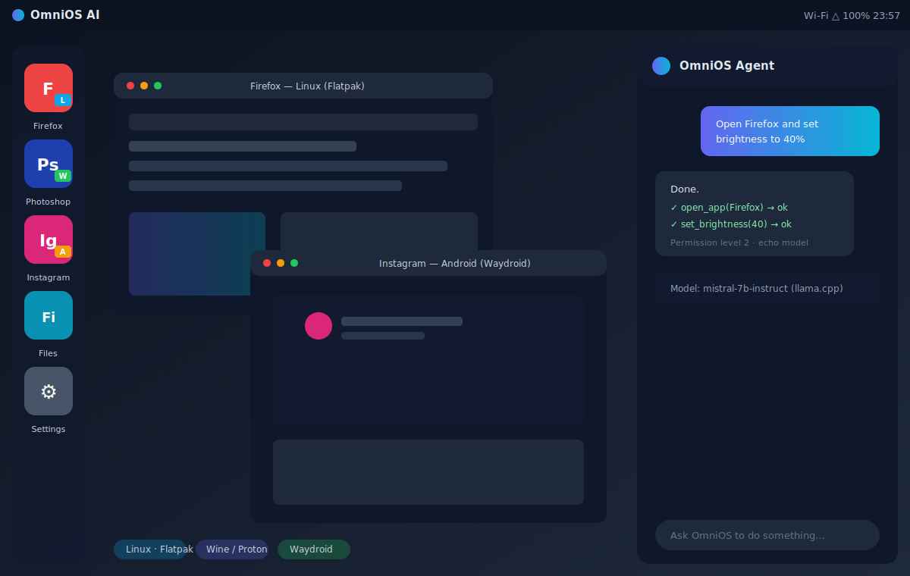

# OmniOS AI (DummyOS)

> A hybrid, Linux-based OS platform that runs **Linux**, **Windows**, and **Android** apps side by side, controlled by an on-device **AI agent** powered by local Hugging Face models.



This repository is the reference implementation / scaffold for the OmniOS AI concept. It does **not** build a kernel from scratch. Instead it layers a unified app runtime, an AI control plane, and a local OS-control daemon on top of an existing Linux base.

## Why

Modern users want one machine that can:

- Run native Linux apps (Flatpak / AppImage / native packages)
- Run Windows apps via Wine/Proton, with a KVM/QEMU VM fallback
- Run Android apps via Waydroid / a containerized Android runtime
- Be driven by a local AI assistant that can open apps, search files, and change settings safely
- Swap in any local Hugging Face model (GGUF, Transformers, ONNX, etc.)

## Architecture

```
┌──────────────────────────────────────┐
│                OmniOS Desktop UI               │
│  Launcher | App Switcher | Settings | Agent    │
└──────────────────────────────────────┘
                      │
┌──────────────────────────────────────┐
│              AI Agent Control Layer            │
│ Intent Parser | Command Router | Permissions   │
│ Local LLM Runtime | Tool Executor | Memory      │
└──────────────────────────────────────┘
                      │
┌──────────────────────────────────────┐
│              App Runtime Layer                 │
│ Linux Apps  | Windows Apps  | Android Apps      │
│ Flatpak     | Wine/Proton   | Waydroid          │
│ Native      | KVM Fallback  | Android Container  │
└──────────────────────────────────────┘
                      │
┌──────────────────────────────────────┐
│             OS Services Layer                  │
│ Files | Network | Audio | Display | Security    │
│ D-Bus | Portals | Package Manager | Updates     │
└──────────────────────────────────────┘
                      │
┌──────────────────────────────────────┐
│              Linux Kernel                      │
│ Drivers | GPU | Filesystems | Containers        │
└──────────────────────────────────────┘
```

See [docs/ARCHITECTURE.md](docs/ARCHITECTURE.md) for details.

## Quick start

```bash
# Install (editable)
pip install -e .

# See available commands
omni --help

# Register and launch apps across platforms
omni app add Firefox --platform linux --command "flatpak run org.mozilla.firefox"
omni app add Photoshop --platform windows --command "wine ~/.omni/windows/photoshop/Photoshop.exe"
omni app add Instagram --platform android --command "waydroid app launch com.instagram.android"
omni app list
omni launch Firefox

# Talk to the local AI agent
omni agent chat "Open Firefox and set brightness to 40%"

# Run the local control daemon (omnid)
omni daemon --host 127.0.0.1 --port 8765
```

## Bootable ISO

A bootable **live ISO** is built by GitHub Actions using Debian live-build. It boots into a Wayland (sway) desktop with the OmniOS app runtimes (Flatpak, Wine, QEMU/KVM) and the `omni` CLI preinstalled.

- **Through GitHub:** the [Build ISO workflow](.github/workflows/build-iso.yml) runs on pushes to `main` that touch `iso/` or `omni/`, on manual dispatch (**Actions → Build ISO → Run workflow**), and on each published release. The image is uploaded as the `omnios-ai-iso` artifact.
- **Locally:** `sudo iso/build-iso.sh` → `dist/omnios-ai-bookworm-amd64.iso`

See [iso/README.md](iso/README.md) for details and how to boot the ISO in QEMU.

## What is realistic vs. not

**Realistic:** a Linux-based OS that runs Linux apps natively, Windows apps via Wine/Proton, Android apps via Waydroid, a local AI assistant with Hugging Face models, basic OS controls, a unified launcher, and a bootable ISO.

**Hard:** perfect Windows/Android compatibility, every HF model format, full GPU passthrough everywhere, anti-cheat games, DRM apps, seamless cross-runtime notifications.

**Not realistic for v1:** writing a brand-new kernel, running every app natively without compatibility layers.

## Status

This is an early scaffold. The runtimes shell out to real tools (`flatpak`, `wine`, `waydroid`, `wpctl`, `brightnessctl`) when present and otherwise run in a safe **dry-run** mode so the code is testable on any machine.

See [docs/ROADMAP.md](docs/ROADMAP.md) for the MVP plan.

## License

MIT — see [LICENSE](LICENSE).
